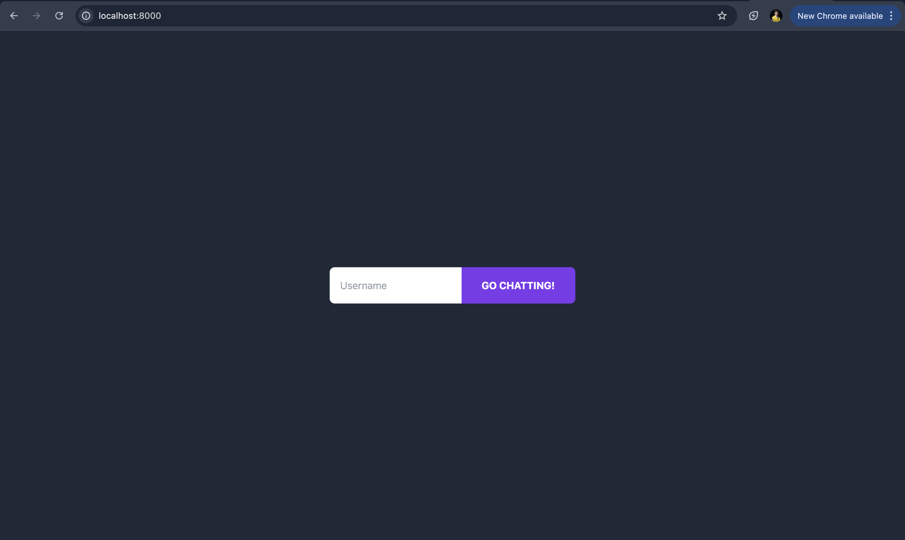
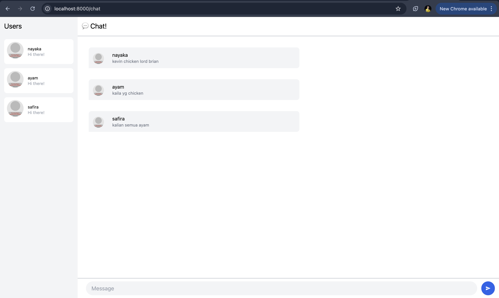
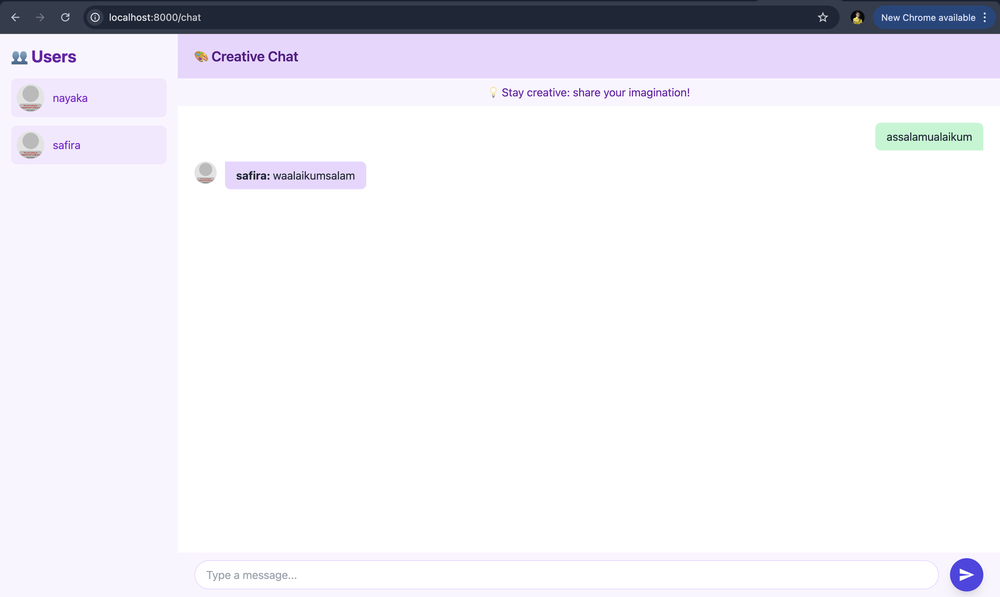

# Module 10 – Asynchronous Programming
**Andhika Nayaka Arya Wibowo · 2306174135**
---
## 3.1 · Tutorial 3: WebChat Using Yew (Original Code)

At this step we focus on the **client** (the Yew-powered web UI). The server is the same WebSocket server you ran in 2.1/2.2; we’ll discuss server changes later.

---

### 1. Run the WebSocket Server

In one terminal, from your `module10broadcast/server` directory:

```bash
cargo run --bin server
```

You should see:

```
listening on port 8080
New connection from 127.0.0.1:XXXXX
…
```

---

### 2. Run the Yew Web Client

In another terminal, change into your Yew client directory (where the client’s `Cargo.toml` and `index.html` live) and run:

```bash
trunk serve --open
```

> _If you don’t have Trunk installed run_
> ```bash
> cargo install trunk
> ```

This will build the Yew app and open your browser at **http://localhost:8000**.

---

### 3. Demo Screenshots

#### Login Page
Visit **http://localhost:8000** and you’ll see a simple login form:



1. Enter a **Username**.
2. Click **GO CHATTING!**

#### Chat Interface
After login you’re redirected to **http://localhost:8000/chat**:



- **Users** sidebar: shows avatars and usernames of everyone currently connected.
- **Chat!** area: displays incoming messages as chat‐bubble cards with avatar, username, and text.
- **Message input** at bottom: type and send—your message is broadcast via WebSocket to **all** connected clients.

---

### 4. What Happens

1. **WebSocket handshake** between Yew client and Rust server on port 8080.
2. On load, the client pushes your chosen username to the server, which adds you to the “Users” list.
3. Every time **any** client sends a message, the server rebroadcasts it to all clients.
4. The Yew UI updates in real time, adding a new chat bubble for each incoming message.

---
## 3.2 · Experiment 3.2: Be Creative!

> **Add some creativity to the WebClient**  
> In this step, you’re free to redesign, extend, or embellish the Yew chat UI however you like. We’ll add a new colour theme, a “Stay creative” banner, custom icons, and a few fun messages to spark imagination.

---


### 1. What I Did

- **Theme overhaul**  
  – Soft purples for sidebar & header  
  – Fresh greens for “my” bubbles  
  – Indigo send button with hover effect
- **“Stay creative” banner**  
  A little prompt under the header to encourage imaginative chat
- **Custom header icon**  
  Replaced plain “Chat!” with a 🎨 paint-palette emoji
- **Bubble styling**  
  – My messages right-aligned in green  
  – Others’ messages left-aligned in purple, with avatars
- **Smooth transitions**  
  Hover states on user cards & send button